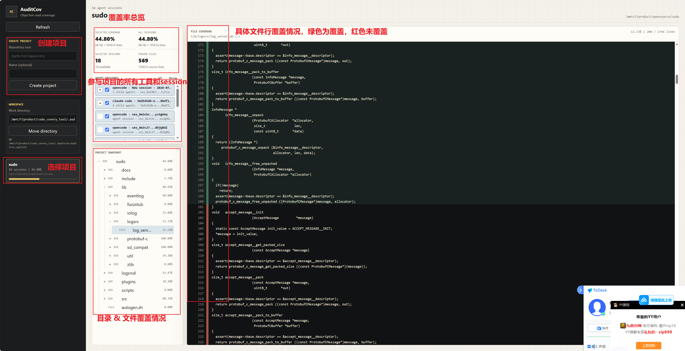
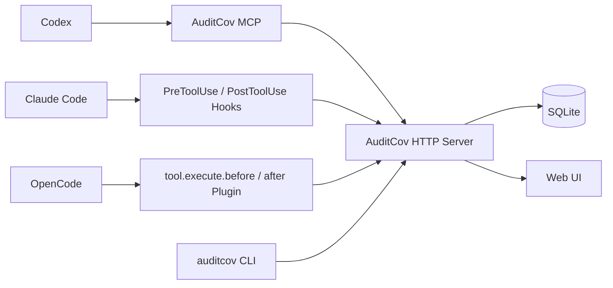

# AuditCov

面向 AI 代码审计的本地客观源码读取覆盖率工具，同时支持 **Codex、Claude Code 和 OpenCode**。

AuditCov 记录每个 Code Agent 会话成功读取过哪些源码文件、哪些完整代码行，并通过统一的 Web 界面展示项目、会话、父子 Agent 和逐文件覆盖情况。它回答的是“Agent 客观上读取过哪些代码”，而不是“Agent 是否理解了代码”或“审计是否已经完成”。

> [!IMPORTANT]
> AuditCov 的覆盖率是**客观读取覆盖率**，不能单独证明代码已经被正确理解、分析或完成安全审计。

## 界面预览



## 功能概览

- 一个本地统计服务同时接收 Codex、Claude Code 和 OpenCode 的读取事件。
- Web 界面创建和管理代码仓项目，无需由 Agent 初始化项目。
- 命令行支持创建/列出项目，并查询全部或指定会话的覆盖率。
- 按项目、工具和原生会话 ID 分开统计覆盖率。
- 展示源码目录树、文件覆盖率、逐行覆盖状态和重复读取热度。
- 支持多选会话，按所选会话读取区间的并集计算覆盖率。
- 支持 Claude Code 和 OpenCode 的父子 Agent 层级展示。
- 父 Agent 和子 Agent 独立统计、独立勾选，不会隐式合并。
- Hook 采用调用前/调用后两阶段关联，只有成功返回的 Read 才计入覆盖。
- 对已创建项目中的超大 Read 请求按完整行边界安全截断。
- 未创建项目中的读取完全忽略，Hook 不修改工具参数。
- 统计服务不可用时放行原工具调用，并写入告警日志。
- 使用 SQLite 保存本地状态，无外部服务和第三方 Python 依赖。
- 提供 Windows/Linux 通用 Python 安装器，可任选安装或卸载一个或多个 Agent 适配器。

## 架构



整个系统分为三层：

1. **Agent 接入层**：Codex 使用 MCP；Claude Code 和 OpenCode 使用各自原生的工具 Hook。
2. **统计服务层**：匹配项目、冻结分母、关联调用前后事件、合并成功读取区间，并保存会话关系。
3. **展示层**：浏览项目、选择会话、展开父子 Agent、查看目录和逐行覆盖信息。

Agent 适配器不维护覆盖率数据库，所有覆盖逻辑都由中央统计服务负责。

## 当前版本的统计边界

AuditCov 第一版只统计明确接入的文件读取路径：

| Agent | 被统计的读取路径 | 当前不会统计 |
| --- | --- | --- |
| Codex | `auditcov_read_file` MCP 工具 | 其他文件工具或 shell 命令 |
| Claude Code | 原生 `Read` 工具 | `cat`、`sed`、`awk`、Python 读文件等 shell 行为 |
| OpenCode | 原生 `read` 工具 | `cat`、`sed`、`awk`、Python 读文件等 shell 行为 |

`grep`、文件名搜索和只返回少量匹配上下文的搜索行为也不计入读取覆盖率。若希望审计过程尽可能完整地反映在 Web 中，应要求 Agent 在直接阅读源码时使用受支持的 Read 路径，不要用 shell 命令绕过。

## 环境要求

- Python 3.10 或更高版本。
- Windows 或 Linux；在 WSL 中使用时应当在 WSL 内运行安装器和统计服务。
- 至少安装了 Codex、Claude Code、OpenCode 中的一种。
- 安装 Codex 适配器时，`codex` 命令必须在 `PATH` 中，并支持插件命令。

项目运行时没有第三方 Python 依赖。在仓库根目录中可直接运行，也可以安装 Python 包以获得 `auditcov`、`auditcov-server` 等命令行入口。

## 快速开始

以下涉及 `pip` 和 `scripts/` 的源码命令应在本仓库根目录执行；完成可编辑安装后，`auditcov` 和 `auditcov-server` 可以在其他目录运行。

### 1. 可选：安装 Python 包

无需安装依赖即可从源码运行。若希望在其他目录使用命令行入口，可执行可编辑安装：

```bash
python -m pip install -e .
```

验证入口是否可用：

```bash
auditcov --help
```

Linux 中如果 `python` 未指向 Python 3，请将本文命令中的 `python` 改为 `python3`。

### 2. 启动统计服务和 Web 界面

```bash
python -m auditcov_mcp.web
```

默认地址：

```text
http://127.0.0.1:8765
```

如果已经执行过可编辑安装，也可以使用：

```bash
auditcov-server
```

可用启动参数：

```text
--host HOST     监听地址，默认 127.0.0.1
--port PORT     监听端口，默认 8765
--db PATH       显式指定 SQLite 数据库
--quiet         不打印启动地址
```

服务第一版需要手动启动。建议先启动服务，再启动 Code Agent。

### 3. 创建项目

Server 启动后，可以直接从命令行创建项目并查看项目 ID：

```bash
auditcov project create /mnt/f/product/example-repository --name example
auditcov project list
```

未安装 Python 包时，等价的源码运行方式是：

```bash
python -m auditcov_mcp.cli project create /mnt/f/product/example-repository --name example
```

也可以打开 `http://127.0.0.1:8765`，在左侧 **Create project** 中填写：

- **Repository root**：代码仓的绝对路径。
- **Name**：可选的显示名称。

点击 **Create project** 后，AuditCov 会扫描整个代码仓并冻结第一版覆盖率分母。项目创建完成前产生的读取不会被补记。

路径必须使用统计服务所在环境能够访问的形式。例如服务运行在 WSL 中时，应填写：

```text
/mnt/f/product/example-repository
```

而不是 Windows 路径：

```text
F:\product\example-repository
```

CLI 与 Server 位于不同系统环境时，同样必须传入 Server 能识别的路径。第一版建议在运行 Server 的同一个 WSL 或 Windows 环境内执行 CLI；路径包含空格时请加引号。

### 4. 安装 Agent 适配器

安装一个工具：

```bash
python scripts/auditcov_install.py install --codex
python scripts/auditcov_install.py install --claude
python scripts/auditcov_install.py install --opencode
```

安装 Codex 时，安装器会创建一份当前用户专用的运行时 marketplace 副本，并将执行安装器的
Python 解释器绝对路径写入 MCP 配置。Linux/WSL 使用 `python3` 运行安装器，Windows 使用
`python`；Codex MCP 不再假定两个平台都存在同名的 `python` 命令。

同时安装多个工具：

```bash
python scripts/auditcov_install.py install --claude --opencode
```

当三个工具均已安装且命令可用时，可以一次安装全部适配器：

```bash
python scripts/auditcov_install.py install --all
```

查看安装状态：

```bash
python scripts/auditcov_install.py status
codex plugin list
```

安装完成后必须完全退出并重新启动对应的 Code Agent。Codex 需要开启一个新任务，Claude Code 和 OpenCode 需要开启新会话或重新启动进程。

### 5. 开始审计并查看覆盖率

命令行可以查询一个项目全部会话的覆盖并集：

```bash
auditcov coverage 1
```

其中 `1` 是 `auditcov project list` 显示的项目 ID。需要脚本处理完整目录树时可追加 `--json`。

- Codex 通过 AuditCov Skill 和三个 MCP 工具读取、查询覆盖率。
- Claude Code 和 OpenCode 在调用原生 Read 工具时自动上报，无需手动调用统计 API。
- 返回 Web 后点击 **Refresh**，选择项目和需要查看的会话。
- 点击目录树中的源码文件，查看成功读取过的行和未读取行。

推荐给 Codex 的提示词：

```text
使用 AuditCov 审计当前仓库。所有源码读取通过 auditcov_read_file 完成，
并定期使用 auditcov_get_coverage 检查客观读取覆盖率。
```

推荐给 Claude Code/OpenCode 的约束：

```text
审计当前项目。直接阅读源代码时使用 Read 工具，
不要使用 cat、sed、awk 或 Python 脚本读取代码文件。
```

## WSL 中使用

如果 Claude Code/OpenCode 运行在 WSL，建议安装器、Web Server 和 SQLite 都放在同一个 WSL 环境中：

```bash
cd /mnt/f/product/code_covery_tool
python3 scripts/auditcov_install.py install --claude --opencode
python3 -m auditcov_mcp.web --host 127.0.0.1 --port 8765
```

在常规 WSL2 配置下，Windows 浏览器可直接访问：

```text
http://localhost:8765
```

如果 Windows 无法访问，请先检查 WSL 的 localhost 转发和 Windows 防火墙。只有确有需要时才使用 `--host 0.0.0.0`；AuditCov 第一版没有身份认证，不应暴露到不可信网络。

## 三种 Agent 的接入原理

### Codex：Skill + MCP

Codex 插件包含 AuditCov Skill 和一个轻量 stdio MCP Server。MCP 自身不保存数据库，只把当前 Codex `thread_id`、读取请求和查询请求转发给中央统计服务。

插件只暴露三个工具：

| 工具 | 用途 |
| --- | --- |
| `auditcov_read_file` | 读取已创建项目内的普通文件并记录审计事件；只有冻结快照内的源码行计入覆盖率 |
| `auditcov_get_coverage` | 查询当前 Codex 任务的项目或文件覆盖率 |
| `auditcov_get_file_detail` | 查询某个文件的已覆盖和未覆盖区间 |

Codex 没有 MCP 初始化工具。项目只能由用户在 Web 中创建，Agent 无法通过模型可控参数缩小项目分母。

Codex 单次响应按约 40 KiB 的完整行边界控制大小。如果读取被截断，工具会返回下一段的起始行，Agent 应继续读取后续范围。

如果文件位于已创建项目中、但因扩展名白名单漏项等原因没有进入冻结快照，Codex 仍会收到文件内容。Server 会把相对路径、读取行区间和读取时的内容哈希写入审计事件，并返回 `snapshot_tracked: false`、`counted: false`；该事件不会改变当前冻结快照的分子或分母。只有路径不属于任何已配置项目时，工具才返回“未配置项目”错误。

### Claude Code：PreToolUse + PostToolUse

安装器向 `~/.claude/settings.json` 增加全局 `Read` Hook，同时保留所有无关 Hook：

1. `PreToolUse(Read)` 获取 `file_path`、`offset`、`limit`、`tool_use_id` 和会话信息。
2. Server 判断文件是否属于已创建项目。
3. 不属于项目时返回透明结果，不修改 Read 参数，也不创建覆盖事件。
4. 属于项目时记录“尝试读取”，并在必要时将 `limit` 缩小到不超过 256 KiB 的完整行范围。
5. `PostToolUse(Read)` 使用相同 `tool_use_id` 关联调用结果。
6. 只有 Read 成功后，实际返回的行范围才计入覆盖率。

Claude Code 主会话使用 `session_id`。子 Agent 的 Read Hook 还会携带 `agent_id` 和 `agent_type`，AuditCov 将 `agent_id` 作为独立子会话，并将主 `session_id` 保存为父会话。

### OpenCode：Plugin Hooks

安装器把 TypeScript 插件复制到用户的 OpenCode 插件目录。插件监听：

- `tool.execute.before(read)`：上报尝试读取，并接收 Server 返回的安全行范围。
- `tool.execute.after(read)`：上报实际工具结果，只有成功结果才计入覆盖率。

OpenCode Read 的单次范围按 51,200 bytes 的完整行边界控制。插件通过 OpenCode Session API 查询并缓存当前 `sessionID` 的 `parentID` 和标题，因此 General 子 Agent 可以挂到其父会话下展示。

Claude Code 和 OpenCode 的调用前、调用后事件必须使用 Agent 原生的 `tool_use_id`/`callID` 关联，AuditCov 不根据文件名或时间窗口猜测调用关系。

## 覆盖率如何计算

### 分母

创建项目时，AuditCov 对整个仓库进行一次源码快照，保存纳入统计文件的相对路径、行数和内容哈希。项目的总行数是这些源码文件行数之和：

```text
总行数 = Σ 项目快照中每个源码文件的行数
```

第一版没有 `src`、`include` 等目标子目录选择，也不允许 Agent 改变分母。

### 分子

每次成功 Read 产生一个完整行区间。同一会话内重复或重叠读取会合并；选择多个会话时再次取这些会话覆盖区间的并集：

```text
覆盖率 = 所选会话成功读取行区间的并集大小 / 项目快照总行数
```

因此：

- 同一行被重复读取不会重复增加覆盖行数，但会增加该行的读取次数。
- 调用前事件只是尝试，不增加覆盖率。
- Read 失败不增加覆盖率。
- 没有传入起止行时按读取整个文件处理，但最终仍以成功返回范围为准。
- 读取不属于任何项目的文件会被忽略。
- Codex 读取属于项目、但不在项目源码快照中的文件时，会返回内容并保存审计事件，但不计入当前覆盖率；Claude Code/OpenCode 的原生 Read Hook 对此仍保持透明，不创建覆盖事件。

### 读取次数

AuditCov 还会对所选会话的每次成功 Read 分别计数。比如先读取 `a.c` 的 1–100 行，再读取 50–200 行，则 1–49 行读取 1 次、50–100 行读取 2 次、101–200 行读取 1 次。

读取次数只影响 Web 文件视图中的绿色深浅，不改变覆盖率分子。绿色越深表示读取次数越多；鼠标停留在行旁的绿色条上可以查看精确次数。失败调用、只有 before 而没有成功 after 的调用，以及同一 `call_id` 的重复上报都不会重复计数。

### 父子 Agent

Web 会把子 Agent 放在父 Agent 下方，点击 `+` 可以展开。父子复选框完全独立：

- 只勾选父 Agent：只计算父 Agent 自己的 Read。
- 只勾选某个子 Agent：只计算该子 Agent 的 Read。
- 同时勾选父 Agent 和多个子 Agent：计算这些已勾选会话的覆盖并集。
- 展开或折叠只影响显示，不改变当前选择。

## 项目快照规则

第一版会纳入以下常见源码扩展名：

```text
.asm .bash .bat .c .cc .cjs .clj .cljs .cmake .cpp .cs .csh .cxx
.dart .erl .ex .exs .fish .fs .fsx .go .h .hh .hpp .hrl .hs .hxx
.java .jl .js .jsx .kt .kts .lua .m .mm .mjs .php .pl .pm .ps1
.py .pyw .r .rb .rs .scala .scm .sh .sql .swift .tcl .ts .tsx
.vb .vue .zig .zsh
```

以下目录默认排除：

```text
.auditcov .git .hg .idea .svn .tox .venv .vscode __pycache__
build coverage dist node_modules out target vendor venv
```

符号链接文件和符号链接目录不会进入快照。

项目根目录不能重叠：一个新项目不能与已有项目相同，也不能是已有项目的父目录或子目录。这避免同一条读取事件同时归属多个项目。

快照在项目创建时冻结，之后仓库新增、删除或大幅修改文件不会自动刷新分母。对于新的代码版本，建议使用新的 AuditCov 工作目录或数据库重新创建项目。

## 命令行

`auditcov` 是中央 HTTP Server 的客户端，不会自行启动 Server，也不会安装 Agent 适配器。执行以下命令前应先启动 `auditcov-server` 或 `python -m auditcov_mcp.web`。

创建和列出项目：

```bash
auditcov project create /mnt/f/product/example-repository --name example
auditcov project list
auditcov project list --sessions
```

`project list --sessions` 会额外显示每个会话的 AuditCov 内部数字 ID、工具名称、原生会话 ID、父会话 ID 和覆盖率。这里的内部 ID 与 Codex `thread_id`、Claude Code `session_id`、OpenCode `sessionID` 不同。

查询项目全部会话，或只查询明确选择的会话：

```bash
auditcov coverage 1
auditcov coverage 1 --session-id 12 --session-id 15
auditcov coverage 1 --no-sessions
```

- 未传 `--session-id` 时统计项目全部会话。
- `--session-id` 可以重复，结果是这些精确会话覆盖区间的并集；选择父会话不会自动包含子会话。
- `--no-sessions` 明确选择空会话集合，分母不变、分子为零。
- 数据命令都支持 `--json`；覆盖率 JSON 会包含完整目录树，大型项目的输出可能较大。
- 数据命令都支持 `--server-url URL` 和 `--timeout SECONDS`。Server 地址默认读取 `AUDITCOV_SERVER_URL`，未配置时使用 `http://127.0.0.1:8765`；默认超时为 300 秒，以容纳大仓库快照创建。

项目创建是同步操作。客户端超时后 Server 可能仍在扫描仓库，此时不要立即重复创建；先运行 `auditcov project list` 确认项目是否已经完成。

## Web 界面

Web 页面提供以下能力：

- **Create project**：用绝对路径创建一个整仓项目。
- **Workspace**：移动 AuditCov 工作目录和数据库；移动时应停止其他 AuditCov MCP/Web 进程。
- **Project list**：选择不同代码仓。
- **All/None**：选择全部会话或清空选择。
- **Session tree**：按 Agent 类型和原生会话 ID 展示父子关系。
- **Project snapshot**：浏览冻结的源码目录树和各文件覆盖状态。
- **可调布局**：拖动目录树与代码区之间的分隔条，扩大层级较深的目录显示范围；宽度会在浏览器中保留。
- **File coverage**：显示选定文件的代码内容、逐行覆盖标记和重复读取热度；悬浮绿色条可查看该行读取次数。

页面中的 **All sessions** 指项目所有会话的覆盖并集；手动勾选后的结果只包含明确选中的会话。

## 数据目录与环境变量

默认数据库位于本仓库下：

```text
.auditcov/auditcov.sqlite3
```

Web 中可以通过 **Workspace** 修改工作目录，配置会写入仓库根目录的 `.auditcov-config.json`。

也可以使用环境变量：

| 变量 | 作用 |
| --- | --- |
| `AUDITCOV_SERVER_URL` | CLI 和 Agent 适配器连接的 Server 地址，默认 `http://127.0.0.1:8765` |
| `AUDITCOV_WORK_DIR` | 指定工作目录；设置后 Web 不允许在线移动工作目录 |
| `AUDITCOV_DB` | 直接指定 SQLite 文件；优先于默认工作目录 |

示例：

```bash
AUDITCOV_WORK_DIR="$HOME/.local/share/auditcov" python -m auditcov_mcp.web
```

PowerShell：

```powershell
$env:AUDITCOV_WORK_DIR = "$HOME\AppData\Local\AuditCov"
python -m auditcov_mcp.web
```

Agent 进程必须能看到 `AUDITCOV_SERVER_URL`。如果 Server 与 Agent 位于不同的系统环境，请为对应 Agent 配置实际可达地址。

## 卸载与更新

卸载指定适配器：

```bash
python scripts/auditcov_install.py uninstall --codex
python scripts/auditcov_install.py uninstall --claude --opencode
python scripts/auditcov_install.py uninstall --all
```

Claude Code 卸载只删除 AuditCov 自己的两个 Hook，不会删除其他 Hook。卸载适配器不会删除 SQLite 数据库或已创建项目。

更新代码后，Hook/Plugin 是复制安装的，因此需要重新运行对应的安装命令：

```bash
git pull
python scripts/auditcov_install.py install --claude --opencode
```

然后重启 Web Server 和对应 Agent。Codex 插件更新后也建议重新安装插件并开启新任务。

## HTTP API

Web UI 和所有 Agent 适配器共用同一个本地 HTTP API。

### 健康检查和设置

| 方法 | 路径 | 用途 |
| --- | --- | --- |
| `GET` | `/api/health` | 返回服务状态和版本 |
| `GET` | `/api/settings` | 返回工作目录、数据库和配置状态 |
| `POST` | `/api/settings/workdir` | 移动默认工作目录 |

### 项目和覆盖率

| 方法 | 路径 | 用途 |
| --- | --- | --- |
| `POST` | `/api/projects` | 创建项目并冻结源码快照 |
| `GET` | `/api/projects` | 列出项目 |
| `GET` | `/api/projects/{id}` | 获取项目和会话列表 |
| `GET` | `/api/projects/{id}/coverage` | 查询所选会话的目录/文件覆盖率 |
| `GET` | `/api/projects/{id}/file` | 查询所选会话的逐行覆盖详情和每行 `read_count` |

### Agent 事件和 Codex 代理

| 方法 | 路径 | 用途 |
| --- | --- | --- |
| `POST` | `/api/read/before` | 记录 Read 尝试并返回必要的截断范围 |
| `POST` | `/api/read/after` | 提交 Read 结果，成功时计入覆盖 |
| `POST` | `/api/codex/read` | 由 Server 实际读取文件并记录 Codex 覆盖 |
| `GET` | `/api/agent/coverage` | 查询某个 Agent 会话的覆盖率 |
| `GET` | `/api/agent/file-detail` | 查询某个 Agent 会话的文件详情 |

调用前事件示例：

```json
{
  "agent_type": "opencode",
  "agent_session_id": "child-session-id",
  "parent_agent_session_id": "parent-session-id",
  "agent_session_title": "General audit agent",
  "parent_agent_session_title": "Repository audit",
  "call_id": "tool-call-id",
  "file_path": "/absolute/path/to/source.c",
  "start_line": 1,
  "end_line": 400
}
```

调用后事件应使用相同的 `agent_type`、`agent_session_id` 和 `call_id`，并增加：

```json
{
  "success": true
}
```

`parent_agent_session_id`、两个标题字段以及起止行都是可选字段。第三方适配器必须先调用 before，再用稳定的工具调用 ID 提交 after；不应把一次失败调用报告为成功。

## 失败处理与日志

Claude Code/OpenCode Hook 的首要原则是不破坏 Agent 原有读文件能力：

- Server 不可用、超时或返回异常时，Read 继续执行。
- 这类读取可能漏记，不会在 Server 恢复后自动补录。
- Claude Code 会把告警写入平台状态目录的 `auditcov/hook-warnings.log`。
- OpenCode 同时尝试写入相同的状态日志并调用 OpenCode 应用日志接口。

常见 Linux/WSL 日志路径：

```text
~/.local/state/auditcov/hook-warnings.log
```

Claude Code 在 Windows 下通常使用：

```text
%LOCALAPPDATA%\auditcov\hook-warnings.log
```

## 常见问题

### Web 覆盖率一直为 0

依次检查：

1. Web Server 是否仍在运行，`http://127.0.0.1:8765/api/health` 是否返回成功。
2. 是否在产生读取前就在 Web 中创建了项目。
3. 项目路径是否与 Agent 上报路径处于同一个系统命名空间，尤其注意 Windows/WSL 路径差异。
4. 安装适配器后是否重启了 Agent。
5. Agent 是否真的使用了受支持的 Read 工具，而不是 `cat`、`sed` 或 Python。
6. Read 是否成功；失败调用和仅有 before 的调用不会计入。
7. 目标文件扩展名和目录是否在项目快照范围内。
8. `auditcov/hook-warnings.log` 是否记录了 Server 不可用或请求异常。

### 项目创建后读其他仓库会怎样

直接忽略。全局 Hook 不会修改不属于任何已创建项目的读取参数，也不会创建覆盖记录。

### 为什么父 Agent 的覆盖率不包含子 Agent

这是有意设计。父 Agent 和每个子 Agent 都是独立审计执行者，勾选父 Agent 只表示引入父 Agent 自己的 Read。需要查看联合覆盖时，应同时勾选对应父 Agent 和子 Agent。

### 为什么搜索结果不计入覆盖率

搜索通常只返回匹配行和少量上下文，不能等同于完整阅读某段源码。AuditCov 第一版保守地把文件发现、关键词搜索和完整源码读取视为不同概念。

### Server 关闭后会阻止 Agent 吗

Claude Code/OpenCode 不会。Hook 会放行原始 Read 并记录本地告警，但这段时间的覆盖率会漏记。Codex 的 AuditCov MCP 工具依赖 Server，Server 不可用时工具会返回错误。

## 已知限制

- 第一版只支持本机、单用户、无认证部署。
- Claude Code/OpenCode 只 Hook 原生 Read，不拦截 shell、语言运行时或第三方工具的读文件行为。
- Codex 只统计通过 `auditcov_read_file` 完成的读取。
- 项目快照创建后不会自动刷新。
- 第一版没有项目子目录选择、用户自定义扩展名或排除规则。
- 第一版不允许创建重叠项目。
- Server 不可用期间放行的 Hook 读取不会自动补录。
- 历史版本已经合并到父会话的数据无法可靠地反向拆分成子 Agent 覆盖。

## 开发与验证

运行全部测试：

```bash
python -m unittest discover -s tests -v
```

安装为可编辑包后也可以使用项目中配置的测试路径运行其他测试工具。

主要目录：

```text
auditcov_mcp/                 中央 HTTP Server、SQLite Store、Codex MCP
auditcov_mcp/web_static/      Web 前端
hooks/claude_code/            Claude Code Hook
hooks/opencode/               OpenCode Plugin
plugins/auditcov/             Codex 插件包
skills/auditcov/              AuditCov Skill 源文件及中文镜像
scripts/auditcov_install.py   跨平台安装器
tests/                        自动化测试
```

仓库中的 `tools/`、`hooks/read_probe/`、部分 `scripts/` 和 `docs/` 还保留了早期 MCP 参数探针、Read Hook 探针及诊断工具，它们不是生产适配器。

## 安全说明

AuditCov 会读取本地源码路径、保存文件快照元数据、会话 ID 和已读取行区间。中央 HTTP Server 当前没有认证和 TLS：

- 默认保持 `127.0.0.1` 监听。
- 不要把端口直接暴露到公网或不可信局域网。
- SQLite 数据库和告警日志可能包含项目路径、会话标识等开发环境信息，请按本地源码数据同等级别保护。
- 上传日志或数据库进行问题排查前，请先检查其中是否含有敏感路径或会话信息。
