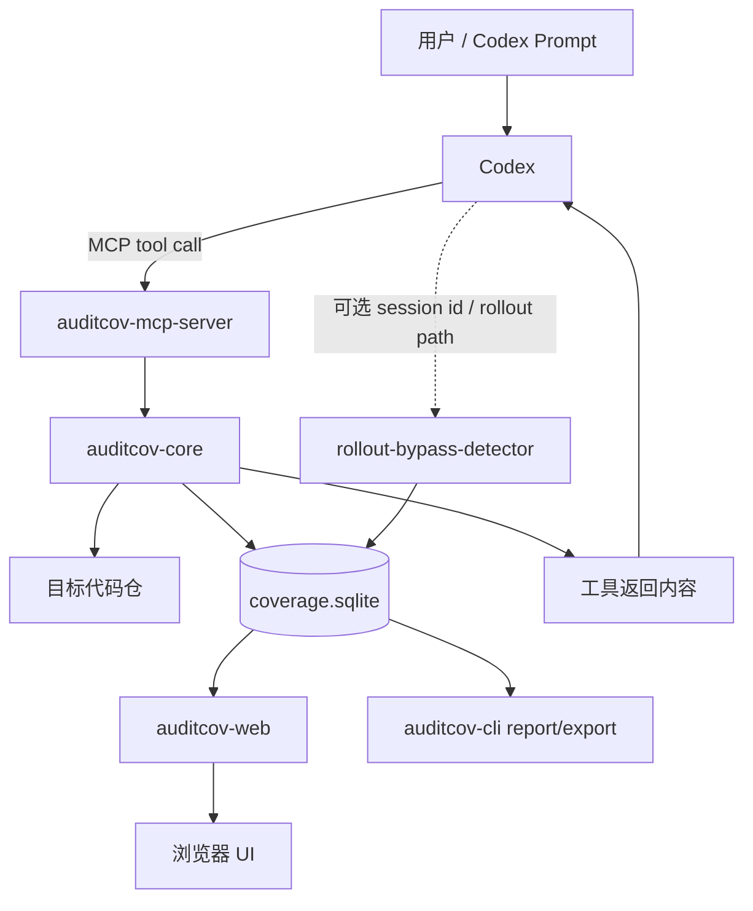

# AI Audit Coverage：Codex v1 详细设计文档

> 版本：v1.0-draft  
> 日期：2026-07-01  
> 范围：Codex-only / MCP 工具 / rollout 绕过检测 / Web 覆盖率展示  
> 核心目标：统计并展示 Code Agent 在安全审计过程中“客观读取过哪些目标源码行”，降低 AI 审计过程中的不可见性和偷懒风险。

---

## 0. 文档结论

第一版本建议实现为：

```text
AuditCov v1
├── auditcov-mcp-server       # Codex 调用的 MCP 工具服务
├── auditcov-core             # 覆盖率计算、路径校验、文件扫描、range merge
├── coverage.sqlite           # 本地状态与证据账本
├── rollout-bypass-detector   # Codex rollout 兜底：只检测绕过，不反推覆盖率
├── auditcov-web              # 本地 Web UI：目录/文件/行级覆盖率展示
└── auditcov-cli              # 初始化、启动 web、导出报告、调试辅助
```

v1 不加入 hook，不强制阻止绕过。v1 的能力边界是：

1. **精确统计 Codex 通过 AuditCov MCP 工具读取过的目标代码行。**
2. **区分 read coverage、snippet exposure、file discovery。**
3. **通过 rollout 文件检测是否出现绕过 AuditCov MCP 的直接源码读取行为。**
4. **在 Web UI 中展示总覆盖率、目录覆盖率、文件覆盖率、行级覆盖情况、文件发现情况和绕过告警。**
5. **通过 `next_uncovered` 和 `finish_check` 驱动 Codex 继续审计未覆盖代码。**

v1 不承诺：

1. 证明模型真的理解了代码。
2. 阻止模型绕过 MCP。
3. 从任意 shell 输出中完整反推出覆盖率。
4. 支持 Claude Code / OpenCode。
5. 支持主观分析覆盖率。
6. 支持风险加权覆盖率。

---

## 1. 背景与问题定义

很多用户会使用 Codex、Claude Code、OpenCode 等 code agent 做安全代码审计，或者基于这些工具开发自己的审计 agent。现有探索通常聚焦于“如何让 agent 更准确发现漏洞”，但很少显式约束：

> Agent 到底看了多少目标代码？

实践中经常出现这种情况：

1. 第一次让 agent 审计一个仓库或模块，agent 报告了一些漏洞。
2. 继续要求 agent 深入审计同一范围，agent 又发现新的重要问题。
3. 这说明 agent 第一次并没有系统性看完目标代码，只是采样式读取了部分文件。

漏洞本身不可能被证明“挖完”，但可以设置一个过程指标，例如：

> 当目标范围内超过 80% 的非空源码行曾经被返回给模型时，认为本轮审计具备最低读取覆盖要求。

本项目引入 **AI Audit Coverage** 概念，第一版重点实现 **Objective Read Coverage**：

> 某一行目标源码是否曾经通过受控工具被返回给模型。

这不是传统测试覆盖率，也不是漏洞覆盖率，而是 **AI 审计过程中的源码暴露覆盖率 / 可见性覆盖率**。

---

## 2. 设计原则

### 2.1 主指标必须客观

主指标只统计工具实际返回给模型的源码行，而不是模型声称自己分析过的行。

v1 中主指标为：

```text
Objective Read Coverage = read_file / read_range 工具返回的目标源码非空行数 / 目标范围内非空源码总行数
```

### 2.2 不让搜索刷主覆盖率

关键词搜索和带上下文搜索确实会把一些代码行暴露给模型，但它们通常是局部、关键词驱动、非系统性的。为了防止 agent 用 grep 类搜索刷覆盖率：

```text
search / search_context 返回的代码行不计入主 read coverage。
```

但这些行应该被记录为：

```text
snippet_exposure
```

Web UI 可以用浅绿色或独立图层展示。

### 2.3 文件发现与代码读取分离

目录枚举、文件名搜索、普通关键词搜索命中文件，都只能说明模型知道该文件存在，不能说明模型看过该文件内容。

因此 v1 维护两个维度：

```text
file_discovery: 文件是否被模型发现过
read_coverage: 文件的哪些行被模型读取过
```

### 2.4 分母必须由用户或外部系统固定

初始化时传入 repo root 和审计目标路径，生成 target manifest。之后覆盖率分母不能由模型任意修改，否则 agent 可以通过缩小目标范围刷高覆盖率。

### 2.5 保守统计

任何不确定模型是否实际看到的内容，都不计入主覆盖率。

v1 的覆盖率可信度分层：

| 数据来源 | 是否计入主覆盖率 | 说明 |
|---|---:|---|
| `auditcov_read_file` 返回的整行源码 | 是 | v1 主数据源 |
| `auditcov_search` / `auditcov_search_context` 返回的源码片段 | 否 | 记录为 snippet exposure |
| `auditcov_list_dir` / `auditcov_find_file` 返回的路径 | 否 | 记录 file discovery |
| rollout 中发现 shell/cat/sed/rg 绕过 | 否 | 记录 violation，不反推 coverage |
| 模型自然语言声称“我看过” | 否 | v1 不实现 subjective coverage |

---

## 3. 外部前提与兼容性说明

### 3.1 Codex MCP 支持

Codex 官方文档显示，Codex 支持 MCP server，且 CLI 和 IDE extension 共享 MCP 配置。MCP 配置可以放在用户级 `~/.codex/config.toml`，也可以放在可信项目的 `.codex/config.toml` 中。

推荐 v1 主要支持 STDIO MCP server，后续再考虑 Streamable HTTP server。

示例配置：

```toml
[mcp_servers.auditcov]
command = "auditcov"
args = ["mcp-server"]
startup_timeout_sec = 20
tool_timeout_sec = 60
enabled = true
required = true

[mcp_servers.auditcov.env]
AUDITCOV_HOME = "/path/to/.auditcov"
```

### 3.2 Codex rollout 文件

Codex CLI 文档中 `--ephemeral` 的说明是“不持久化 session rollout files 到磁盘”。因此 v1 可以把 rollout 文件作为可选兜底数据源：

1. 非 ephemeral 模式下，尝试定位和解析 rollout。
2. ephemeral 模式或定位失败时，不执行 rollout 检测。
3. rollout 检测失败不得影响 MCP 主覆盖率统计，但会降低 confidence。

v1 不强依赖 rollout 格式稳定。rollout parser 必须容错：

```text
能解析则记录 violation
不能解析则记录 rollout_unavailable / rollout_parse_error
```

### 3.3 v1 不使用 Codex hooks

虽然 Codex 当前有 hooks 机制，但 v1 明确不使用 hook，不做 before-tool enforcement。原因：

1. 快速验证核心概念。
2. 避免早期陷入权限、hook trust、shell 改写、跨平台细节。
3. 先让 MCP 工具和 Web 覆盖率闭环跑通。

v2 再考虑加入 hook strict mode。

---

## 4. 核心概念

### 4.1 Project

一次审计项目，包含：

```text
repo_root
目标路径 target_paths
include / exclude 规则
Codex session id
可选 rollout path
coverage.sqlite
初始化时文件快照
```

### 4.2 Target Manifest

初始化生成的目标范围清单，是覆盖率分母的来源。

示例：

```yaml
repo_root: /repo/linux
target_paths:
  - drivers/nfc
  - net/nfc
  - include/net/nfc
include_globs:
  - "**/*.c"
  - "**/*.h"
  - "**/*.cc"
  - "**/*.cpp"
  - "**/*.rs"
exclude_globs:
  - "**/test/**"
  - "**/tests/**"
  - "**/vendor/**"
  - "**/third_party/**"
  - "**/generated/**"
  - "**/*.min.js"
denominator_mode: nonblank_lines
codex_session_id: 00000000-0000-0000-0000-000000000000
rollout_path: null
```

### 4.3 File Discovery

文件被模型通过以下方式看到文件路径，即记为 discovered：

1. `auditcov_list_dir`
2. `auditcov_list_tree`
3. `auditcov_find_file`
4. `auditcov_search` 命中文件
5. `auditcov_read_file` 读取文件

文件 discovery 不等于代码覆盖。

### 4.4 Read Coverage

文件某些源码行通过 `auditcov_read_file` 返回给模型，计为 read coverage。

只统计整行。工具永远不返回半行。

### 4.5 Snippet Exposure

关键词搜索返回的命中行或上下文行，计为 snippet exposure。

它表示模型看到过这些片段，但不进入主 read coverage。

### 4.6 Bypass Violation

rollout 中检测到 agent 使用非 AuditCov MCP 的方式读取目标代码，例如：

```bash
cat drivers/nfc/foo.c
sed -n '1,100p' net/nfc/core.c
rg -n -C 3 copy_from_user drivers/nfc
python3 - <<'PY'
print(open('drivers/nfc/foo.c').read())
PY
```

v1 只记录绕过事件，不把这些输出反推为 coverage。

---

## 5. 总体架构



组件职责：

| 组件 | 职责 |
|---|---|
| `auditcov-mcp-server` | 向 Codex 暴露受控读取、搜索、枚举、覆盖率查询工具 |
| `auditcov-core` | 路径校验、目标扫描、文件读取、range merge、覆盖率计算 |
| `coverage.sqlite` | 持久化 project、files、coverage ranges、tool calls、violations |
| `rollout-bypass-detector` | 读取 Codex rollout，检测疑似绕过行为 |
| `auditcov-web` | 展示目录树、文件视图、覆盖率、发现状态、violation |
| `auditcov-cli` | 初始化、启动服务、导出报告、维护任务 |

---

## 6. 推荐目录结构

```text
auditcov/
├── pyproject.toml / package.json / Cargo.toml
├── src/
│   ├── auditcov/
│   │   ├── mcp_server/
│   │   │   ├── server.py
│   │   │   └── tools.py
│   │   ├── core/
│   │   │   ├── project.py
│   │   │   ├── scanner.py
│   │   │   ├── paths.py
│   │   │   ├── reader.py
│   │   │   ├── search.py
│   │   │   ├── coverage.py
│   │   │   └── ranges.py
│   │   ├── storage/
│   │   │   ├── db.py
│   │   │   └── schema.sql
│   │   ├── rollout/
│   │   │   ├── locator.py
│   │   │   ├── parser.py
│   │   │   └── bypass_detector.py
│   │   ├── web/
│   │   │   ├── app.py
│   │   │   ├── api.py
│   │   │   └── static/
│   │   └── cli.py
│   └── tests/
└── docs/
```

语言选择建议：

| 语言 | 优点 | v1 适合度 |
|---|---|---:|
| Python | 实现快，SQLite/Web/MCP 生态方便 | 高 |
| Node/TypeScript | MCP SDK 和前端集成自然 | 高 |
| Rust | 性能、单二进制分发好 | 中，高质量版本适合 |
| Go | 单二进制、并发与文件扫描好 | 中 |

v1 推荐 Python 或 TypeScript；如果目标是做安全工具并希望单文件分发，v1.5 可迁移到 Rust/Go。

---

## 7. 数据模型

### 7.1 SQLite schema

```sql
CREATE TABLE projects (
  id TEXT PRIMARY KEY,
  name TEXT,
  repo_root TEXT NOT NULL,
  repo_realpath TEXT NOT NULL,
  git_commit TEXT,
  git_dirty INTEGER NOT NULL DEFAULT 0,
  denominator_mode TEXT NOT NULL,
  codex_session_id TEXT,
  rollout_path TEXT,
  created_at TEXT NOT NULL,
  updated_at TEXT NOT NULL
);

CREATE TABLE targets (
  id INTEGER PRIMARY KEY AUTOINCREMENT,
  project_id TEXT NOT NULL,
  path TEXT NOT NULL,
  realpath TEXT NOT NULL,
  FOREIGN KEY(project_id) REFERENCES projects(id)
);

CREATE TABLE files (
  id INTEGER PRIMARY KEY AUTOINCREMENT,
  project_id TEXT NOT NULL,
  path TEXT NOT NULL,
  realpath TEXT NOT NULL,
  sha256 TEXT NOT NULL,
  mtime_ns INTEGER NOT NULL,
  size_bytes INTEGER NOT NULL,
  raw_line_count INTEGER NOT NULL,
  nonblank_line_count INTEGER NOT NULL,
  is_target INTEGER NOT NULL DEFAULT 1,
  is_binary INTEGER NOT NULL DEFAULT 0,
  is_supported INTEGER NOT NULL DEFAULT 1,
  created_at TEXT NOT NULL,
  UNIQUE(project_id, path),
  FOREIGN KEY(project_id) REFERENCES projects(id)
);

CREATE TABLE file_lines (
  file_id INTEGER NOT NULL,
  line_no INTEGER NOT NULL,
  is_blank INTEGER NOT NULL,
  byte_start INTEGER,
  byte_end INTEGER,
  PRIMARY KEY(file_id, line_no),
  FOREIGN KEY(file_id) REFERENCES files(id)
);

CREATE TABLE tool_calls (
  id TEXT PRIMARY KEY,
  project_id TEXT NOT NULL,
  codex_session_id TEXT,
  tool_name TEXT NOT NULL,
  input_json TEXT NOT NULL,
  output_meta_json TEXT,
  started_at TEXT NOT NULL,
  finished_at TEXT,
  status TEXT NOT NULL,
  FOREIGN KEY(project_id) REFERENCES projects(id)
);

CREATE TABLE file_discovery (
  id INTEGER PRIMARY KEY AUTOINCREMENT,
  project_id TEXT NOT NULL,
  file_id INTEGER NOT NULL,
  source TEXT NOT NULL,
  tool_call_id TEXT,
  discovered_at TEXT NOT NULL,
  UNIQUE(file_id, source, tool_call_id),
  FOREIGN KEY(project_id) REFERENCES projects(id),
  FOREIGN KEY(file_id) REFERENCES files(id),
  FOREIGN KEY(tool_call_id) REFERENCES tool_calls(id)
);

CREATE TABLE coverage_ranges (
  id INTEGER PRIMARY KEY AUTOINCREMENT,
  project_id TEXT NOT NULL,
  file_id INTEGER NOT NULL,
  kind TEXT NOT NULL,
  start_line INTEGER NOT NULL,
  end_line INTEGER NOT NULL,
  source TEXT NOT NULL,
  tool_call_id TEXT,
  returned_bytes INTEGER,
  returned_line_count INTEGER,
  confirmed_by_rollout INTEGER NOT NULL DEFAULT 0,
  created_at TEXT NOT NULL,
  FOREIGN KEY(project_id) REFERENCES projects(id),
  FOREIGN KEY(file_id) REFERENCES files(id),
  FOREIGN KEY(tool_call_id) REFERENCES tool_calls(id)
);

CREATE TABLE violations (
  id INTEGER PRIMARY KEY AUTOINCREMENT,
  project_id TEXT NOT NULL,
  codex_session_id TEXT,
  kind TEXT NOT NULL,
  path TEXT,
  confidence TEXT NOT NULL,
  evidence_json TEXT NOT NULL,
  detected_at TEXT NOT NULL,
  FOREIGN KEY(project_id) REFERENCES projects(id)
);

CREATE TABLE rollout_scans (
  id INTEGER PRIMARY KEY AUTOINCREMENT,
  project_id TEXT NOT NULL,
  rollout_path TEXT,
  status TEXT NOT NULL,
  parsed_events INTEGER NOT NULL DEFAULT 0,
  detected_violations INTEGER NOT NULL DEFAULT 0,
  error TEXT,
  scanned_at TEXT NOT NULL,
  FOREIGN KEY(project_id) REFERENCES projects(id)
);
```

### 7.2 `coverage_ranges.kind`

```text
read_coverage      # 由 auditcov_read_file 产生，进入主覆盖率
snippet_exposure   # 由 search/search_context 产生，不进入主覆盖率
```

### 7.3 `file_discovery.source`

```text
read_file
list_dir
list_tree
find_file
search
search_context
```

### 7.4 `violations.kind`

```text
direct_source_read_bypass
rollout_unavailable
rollout_parse_error
file_changed_after_init
path_escape_attempt
unsupported_file_skipped
```

---

## 8. 覆盖率计算

### 8.1 文件覆盖率

文件主覆盖率：

```text
file_read_coverage = covered_nonblank_lines(file) / total_nonblank_lines(file)
```

其中：

```text
covered_nonblank_lines(file)
= union(read_coverage ranges) 与非空行集合的交集大小
```

### 8.2 目录覆盖率

目录主覆盖率：

```text
dir_read_coverage = sum(covered_nonblank_lines(files under dir)) / sum(total_nonblank_lines(files under dir))
```

只统计 target manifest 内的文件。

### 8.3 总覆盖率

```text
total_read_coverage = sum(covered_nonblank_lines(all target files)) / sum(total_nonblank_lines(all target files))
```

### 8.4 文件发现率

```text
file_discovery_percent = discovered_target_files / all_target_files
```

### 8.5 Snippet exposure 百分比

```text
snippet_exposure_percent = snippet_exposed_nonblank_lines / total_nonblank_lines
```

此指标只作为辅助图层，不进入 finish gate 的主 read coverage。

### 8.6 Stale coverage

如果文件当前 hash 与 init 时 hash 不一致：

```text
该文件 coverage 标记为 stale
该文件仍可展示历史 coverage，但不计入有效主覆盖率
UI 标红提示 file changed after init
```

v1 可以先采用简单策略：

```text
计算覆盖率时，如果文件 hash changed，则该文件 covered lines = 0，并在 numerator 中排除历史 coverage。
```

或提供配置：

```yaml
stale_policy: exclude_covered | warn_only
```

默认推荐：`exclude_covered`。

---

## 9. MCP 工具设计

v1 建议暴露 8 个工具：

```text
auditcov_init
auditcov_read_file
auditcov_search
auditcov_list_dir
auditcov_find_file
auditcov_get_coverage
auditcov_next_uncovered
auditcov_finish_check
```

MCP server 的 `instructions` 应该明确告诉 Codex：

```text
You must use AuditCov tools for source-code audit reading within initialized target paths.
Use auditcov_read_file for reading source ranges.
Use auditcov_search only for locating relevant code; search results do not count toward read coverage.
Use auditcov_next_uncovered to continue reviewing uncovered code before finalizing.
```

注意：v1 没有 hook，因此 instructions 是软约束，不是安全边界。

---

## 10. Tool: `auditcov_init`

### 10.1 目的

初始化审计项目，固定覆盖率分母，建立文件快照，记录 Codex session 信息。

### 10.2 输入 schema

```json
{
  "repo_root": "/absolute/path/to/repo",
  "target_paths": ["drivers/nfc", "net/nfc", "include/net/nfc"],
  "include_globs": ["**/*.c", "**/*.h", "**/*.cc", "**/*.cpp", "**/*.rs"],
  "exclude_globs": ["**/test/**", "**/tests/**", "**/vendor/**", "**/third_party/**", "**/generated/**", "**/*.min.js"],
  "denominator_mode": "nonblank_lines",
  "codex_session_id": "optional-session-id",
  "rollout_path": "optional-explicit-rollout-path",
  "project_name": "optional-human-readable-name",
  "force": false
}
```

### 10.3 输出 schema

```json
{
  "project_id": "uuid",
  "repo_root": "/absolute/path/to/repo",
  "target_paths": ["drivers/nfc", "net/nfc", "include/net/nfc"],
  "target_file_count": 58,
  "target_raw_lines": 12345,
  "target_nonblank_lines": 9876,
  "git_commit": "abcdef1234",
  "git_dirty": false,
  "database_path": "/repo/.auditcov/coverage.sqlite",
  "web_url": "http://127.0.0.1:7788/projects/uuid",
  "warnings": []
}
```

### 10.4 行为要求

初始化时必须：

1. `repo_root` 必须是绝对路径或可解析为绝对路径。
2. 对 `repo_root` 和 `target_paths` 做 realpath。
3. 禁止 target 逃逸到 repo 外。
4. 扫描目标文件。
5. 计算每个文件 hash、mtime、size、raw line count、nonblank line count。
6. 记录 git commit 和 dirty 状态。
7. 创建 SQLite 数据库。
8. 如果已有项目且 `force=false`，返回已有 project 信息或报错，避免模型重置分母。

### 10.5 target path 安全校验

路径校验伪代码：

```python
def resolve_target(repo_root, user_path):
    repo = realpath(repo_root)
    target = realpath(join(repo, user_path))
    if not target.startswith(repo + os.sep) and target != repo:
        raise PathEscapeError(user_path)
    return target
```

Symlink 默认策略：

```text
如果 symlink 指向 repo 内，可以允许。
如果 symlink 指向 repo 外，拒绝。
```

---

## 11. Tool: `auditcov_read_file`

### 11.1 目的

读取目标文件的整行源码，并记录 read coverage。

### 11.2 输入 schema

```json
{
  "path": "drivers/nfc/foo.c",
  "start_line": 1,
  "end_line": 200,
  "max_bytes": 8192,
  "max_lines": 200
}
```

字段说明：

| 字段 | 必填 | 默认值 | 说明 |
|---|---:|---:|---|
| `path` | 是 | 无 | repo 相对路径 |
| `start_line` | 否 | 1 | 从第几行开始 |
| `end_line` | 否 | null | 指定结束行；不传则读到预算耗尽 |
| `max_bytes` | 否 | server 默认 | 返回内容最大字节数 |
| `max_lines` | 否 | server 默认 | 返回最大行数 |

### 11.3 输出 schema

```json
{
  "project_id": "uuid",
  "tool_call_id": "uuid",
  "path": "drivers/nfc/foo.c",
  "file_hash": "sha256:...",
  "start_line": 1,
  "end_line": 137,
  "requested_start_line": 1,
  "requested_end_line": 200,
  "returned_line_count": 137,
  "returned_bytes": 7930,
  "complete_file": false,
  "next_start_line": 138,
  "coverage_recorded": true,
  "content_format": "numbered_lines",
  "content": "1: ...\n2: ...\n...\n137: ...\n[AUDITCOV_END call_id=... path=drivers/nfc/foo.c lines=1-137 sha256=...]"
}
```

### 11.4 读取预算

不建议 v1 动态依赖 Codex 当前截断阈值。推荐 AuditCov 自己设保守预算：

```yaml
read_defaults:
  default_max_return_bytes: 8192
  default_max_return_lines: 160
  hard_max_return_bytes: 16384
  hard_max_return_lines: 300
```

原因：Codex 工具输出截断策略可能随版本变化。AuditCov 的目标不是一次返回最大，而是保证返回内容完整、可追踪、不会被截断。

### 11.5 永远不返回半行

如果加入下一行会超过 `max_bytes`，则停止，不返回该行。

伪代码：

```python
buf = []
bytes_used = 0
for line_no in range(start_line, requested_end + 1):
    rendered = f"{line_no}: {line}"
    encoded_len = len(rendered.encode("utf-8"))
    if buf and bytes_used + encoded_len > max_bytes:
        break
    if len(buf) >= max_lines:
        break
    buf.append(rendered)
    bytes_used += encoded_len
```

如果单行本身超过 hard limit：

```text
返回错误 line_too_long，不记录该行 coverage。
```

### 11.6 记录覆盖率的时机

MCP server 在构造完最终 content 之后记录 coverage：

```text
记录实际返回的 start_line-end_line
不要记录 requested range
```

### 11.7 完整性 marker

每个 read 输出末尾追加：

```text
[AUDITCOV_END call_id=<uuid> path=<path> lines=<start>-<end> sha256=<sha256>]
```

v1 可以先不做 confirmed_by_rollout，但 marker 为后续 rollout 精确确认打基础。

---

## 12. Tool: `auditcov_search`

### 12.1 目的

搜索关键词或正则，帮助模型定位相关文件和代码位置。

### 12.2 输入 schema

```json
{
  "query": "copy_from_user",
  "scope": "drivers/nfc",
  "regex": false,
  "case_sensitive": true,
  "context_lines": 0,
  "max_matches": 100,
  "max_files": 50,
  "max_bytes": 12000
}
```

`context_lines = 0` 表示普通搜索，只返回命中行。  
`context_lines > 0` 表示带上下文搜索，返回命中行上下 n 行。

### 12.3 输出 schema

```json
{
  "project_id": "uuid",
  "tool_call_id": "uuid",
  "query": "copy_from_user",
  "scope": "drivers/nfc",
  "regex": false,
  "context_lines": 3,
  "truncated": false,
  "match_count": 12,
  "file_count": 4,
  "results": [
    {
      "path": "drivers/nfc/foo.c",
      "matches": [
        {
          "line_no": 120,
          "start_line": 117,
          "end_line": 123,
          "content": "117: ...\n118: ...\n...\n123: ..."
        }
      ]
    }
  ],
  "coverage_recorded": {
    "read_coverage": false,
    "snippet_exposure": true,
    "file_discovery": true
  }
}
```

### 12.4 搜索计入规则

| 搜索类型 | file discovery | snippet exposure | read coverage |
|---|---:|---:|---:|
| 普通搜索，返回命中行 | 是 | 是 | 否 |
| 带上下文搜索 | 是 | 是 | 否 |
| 只返回文件名的搜索 | 是 | 否 | 否 |

### 12.5 正则安全

所有搜索支持 regex，但必须设置安全限制：

```yaml
search_limits:
  regex_timeout_ms: 2000
  max_matches: 100
  max_files: 50
  max_return_bytes: 12000
  skip_binary_files: true
```

实现上可以用：

1. 内置 regex engine，设置 timeout。
2. 或调用 `rg --json`，并设置进程 timeout。

由于搜索工具内部读取文件只是服务端实现细节，不影响覆盖率统计；只有返回给模型的结果会记录 snippet exposure。

---

## 13. Tool: `auditcov_list_dir`

### 13.1 目的

列出目录中的直接子项，记录文件发现。

### 13.2 输入 schema

```json
{
  "path": "drivers/nfc",
  "cursor": null,
  "page_size": 100,
  "include_files": true,
  "include_dirs": true
}
```

### 13.3 输出 schema

```json
{
  "project_id": "uuid",
  "tool_call_id": "uuid",
  "path": "drivers/nfc",
  "entries": [
    {
      "name": "foo.c",
      "path": "drivers/nfc/foo.c",
      "type": "file",
      "raw_line_count": 320,
      "nonblank_line_count": 250,
      "read_coverage_percent": 0.0,
      "discovered": true
    },
    {
      "name": "subsys",
      "path": "drivers/nfc/subsys",
      "type": "directory",
      "read_coverage_percent": 0.0,
      "discovered_file_count": 0,
      "target_file_count": 3
    }
  ],
  "next_cursor": null,
  "coverage_recorded": {
    "read_coverage": false,
    "snippet_exposure": false,
    "file_discovery": true
  }
}
```

### 13.4 为什么不默认递归返回所有文件

大型仓库中递归列出目录可能导致工具输出被截断。因此 v1 默认只列直接子项。

如果后续需要递归，可以增加：

```text
auditcov_list_tree
```

但 v1 可以先不暴露，或作为 `auditcov_list_dir(recursive=true)` 的分页模式。

---

## 14. Tool: `auditcov_find_file`

### 14.1 目的

按文件名、glob 或 regex 在指定范围内查找文件路径，记录文件发现。

### 14.2 输入 schema

```json
{
  "name": "foo.c",
  "scope": "drivers/nfc",
  "match_mode": "exact",
  "regex": false,
  "max_results": 100
}
```

`match_mode`：

```text
exact
contains
glob
regex
```

### 14.3 输出 schema

```json
{
  "project_id": "uuid",
  "tool_call_id": "uuid",
  "results": [
    {
      "path": "drivers/nfc/foo.c",
      "raw_line_count": 320,
      "nonblank_line_count": 250,
      "read_coverage_percent": 0.0,
      "discovered": true
    }
  ],
  "truncated": false,
  "coverage_recorded": {
    "read_coverage": false,
    "snippet_exposure": false,
    "file_discovery": true
  }
}
```

---

## 15. Tool: `auditcov_get_coverage`

### 15.1 目的

让 Codex 查询当前覆盖率，用于判断下一步工作。

### 15.2 输入 schema

```json
{
  "scope": "total",
  "path": null,
  "include_ranges": false,
  "include_uncovered": false
}
```

`scope` 可选值：

```text
total
directory
file
file_lines
```

### 15.3 总覆盖率输出

```json
{
  "project_id": "uuid",
  "scope": "total",
  "read_coverage_percent": 73.4,
  "snippet_exposure_percent": 6.8,
  "file_discovery_percent": 88.1,
  "files": {
    "target": 58,
    "discovered": 51,
    "read": 34,
    "stale": 0
  },
  "lines": {
    "target_nonblank": 9876,
    "read_covered_nonblank": 7248,
    "snippet_exposed_nonblank": 672
  },
  "violations": {
    "direct_source_read_bypass": 0,
    "rollout_status": "not_scanned"
  },
  "confidence": "medium"
}
```

### 15.4 文件覆盖率输出

```json
{
  "project_id": "uuid",
  "scope": "file",
  "path": "drivers/nfc/foo.c",
  "read_coverage_percent": 61.2,
  "snippet_exposure_percent": 8.3,
  "discovered": true,
  "stale": false,
  "covered_ranges": ["1-137", "210-260"],
  "uncovered_ranges": ["138-209", "261-320"]
}
```

### 15.5 文件具体覆盖情况输出

```json
{
  "project_id": "uuid",
  "scope": "file_lines",
  "path": "drivers/nfc/foo.c",
  "raw_line_count": 320,
  "nonblank_line_count": 250,
  "read_covered_ranges": ["1-137", "210-260"],
  "snippet_exposed_ranges": ["150-156"],
  "uncovered_ranges": ["138-209", "261-320"],
  "discovered": true,
  "stale": false
}
```

---

## 16. Tool: `auditcov_next_uncovered`

### 16.1 目的

驱动 agent 继续读取未覆盖代码，而不是只看覆盖率数字后自行结束。

### 16.2 输入 schema

```json
{
  "scope": null,
  "strategy": "largest_gap",
  "limit": 5,
  "max_suggested_lines": 160
}
```

`strategy` 可选：

```text
largest_gap       # 优先返回最大未覆盖连续区间
lowest_file_cov   # 优先返回覆盖率最低文件
undiscovered      # 优先返回未发现文件
sequential        # 按目录顺序返回下一段未覆盖代码
```

### 16.3 输出 schema

```json
{
  "project_id": "uuid",
  "strategy": "largest_gap",
  "items": [
    {
      "path": "drivers/nfc/foo.c",
      "file_read_coverage_percent": 43.1,
      "uncovered_ranges": ["261-420"],
      "reason": "largest uncovered range",
      "suggested_read": {
        "path": "drivers/nfc/foo.c",
        "start_line": 261,
        "end_line": 420
      }
    }
  ]
}
```

### 16.4 策略建议

v1 默认使用：

```text
largest_gap
```

因为它实现简单，也最直接推动覆盖率提升。

后续 v2 可加入 risk-aware 策略，例如优先 ioctl、parser、copy_from_user、unsafe、权限检查代码。

---

## 17. Tool: `auditcov_finish_check`

### 17.1 目的

判断是否达到本轮审计最低读取完成标准，并给出下一步建议。

### 17.2 输入 schema

```json
{
  "required_read_coverage_percent": 80.0,
  "required_file_discovery_percent": 95.0,
  "allow_bypass_violations": false,
  "allow_stale_files": false
}
```

### 17.3 输出 schema

```json
{
  "project_id": "uuid",
  "pass": false,
  "read_coverage_percent": 72.4,
  "file_discovery_percent": 88.1,
  "snippet_exposure_percent": 5.2,
  "violations": {
    "direct_source_read_bypass": 0,
    "rollout_status": "scanned"
  },
  "stale_files": 0,
  "reasons": [
    "read coverage 72.4% is below required 80.0%",
    "file discovery 88.1% is below required 95.0%"
  ],
  "next_actions": [
    {
      "tool": "auditcov_read_file",
      "arguments": {
        "path": "drivers/nfc/foo.c",
        "start_line": 261,
        "end_line": 420
      }
    }
  ]
}
```

### 17.4 推荐 Codex 使用方式

Prompt 中应要求 Codex：

```text
最终报告前必须调用 auditcov_finish_check。
如果 pass=false，不得声称审计完成；必须继续调用 auditcov_next_uncovered 和 auditcov_read_file。
```

v1 这依然是软约束，但能显著改善流程。

---

## 18. Rollout 绕过检测

### 18.1 目的

v1 的 rollout parser 不反推覆盖率，只检测疑似绕过行为。

目标是发现：

```text
Codex 是否通过非 auditcov MCP 工具获取了目标源码内容。
```

### 18.2 输入来源

优先级：

1. `auditcov_init.rollout_path` 显式传入。
2. `codex_session_id` 自动定位。
3. 如果无法定位，记录 `rollout_unavailable`。

### 18.3 检测对象

v1 重点检测 shell 命令：

```text
cat
sed
awk
perl
python/node/ruby -e 或 heredoc open/read
head
tail
nl
less/more
rg
grep
find -exec cat/sed/grep
xargs cat/sed/grep
```

### 18.4 检测规则

#### 高置信规则

命令中明确出现目标文件路径，并且命令是读取源码：

```bash
cat drivers/nfc/foo.c
sed -n '1,100p' drivers/nfc/foo.c
head -n 200 drivers/nfc/foo.c
```

记录：

```json
{
  "kind": "direct_source_read_bypass",
  "path": "drivers/nfc/foo.c",
  "confidence": "high",
  "evidence": {
    "tool": "Bash",
    "command": "cat drivers/nfc/foo.c"
  }
}
```

#### 中置信规则

命令在目标目录下执行递归搜索，并可能返回源码内容：

```bash
rg -n "copy_from_user" drivers/nfc
 grep -R -n "memcpy" net/nfc
```

记录：

```json
{
  "kind": "direct_source_read_bypass",
  "path": "drivers/nfc",
  "confidence": "medium",
  "evidence": {
    "tool": "Bash",
    "command": "rg -n copy_from_user drivers/nfc"
  }
}
```

#### 低置信规则

命令疑似读取文件，但路径、当前目录或输出映射不明确：

```bash
python3 analyze.py
```

如果无法确定读了哪些目标文件，记录为 low confidence，不影响主覆盖率，只降低 confidence。

### 18.5 不计入 coverage

即使命令是：

```bash
cat drivers/nfc/foo.c
```

v1 也只记录 violation，不把 `foo.c` 算 covered。原因：

1. rollout 结构可能变化。
2. shell 输出可能被截断。
3. 命令输出与路径行号映射可能复杂。
4. 第一版目标是稳定验证 MCP 主链路。

v2 可以增加 rollout output parser，将高置信 shell 输出补记为 `external_exposure` 或 `read_coverage_candidate`。

### 18.6 rollout 扫描触发

触发方式：

1. `auditcov_get_coverage` 时异步或同步扫描一次。
2. `auditcov_finish_check` 强制扫描一次。
3. Web UI 手动点击 rescan。
4. CLI：`auditcov rollout-scan --project <id>`。

v1 推荐 `finish_check` 同步扫描，其他场景采用缓存结果。

---

## 19. Web UI 设计

### 19.1 页面结构

```text
顶部 Summary Bar
├── Total Read Coverage
├── Snippet Exposure
├── File Discovery
├── Bypass Violations
├── Stale Files
└── Confidence

左侧 Target Tree
├── 目录覆盖率
├── 文件覆盖率
├── discovered 状态
└── stale / violation 标记

中间 File Viewer
├── 行号
├── 源码内容
├── read covered 高亮
├── snippet exposed 高亮
├── unseen 灰色
└── stale 提示

右侧 Evidence Panel
├── 当前文件统计
├── covered ranges
├── uncovered ranges
├── tool call 证据
└── violation 证据
```

### 19.2 Summary Bar 示例

```text
Objective Read Coverage: 76.3%
Snippet Exposure: 5.2%
Files Discovered: 48 / 58 = 82.8%
Files Read: 32 / 58
Bypass Violations: 0
Stale Files: 0
Confidence: High
```

### 19.3 目录树展示

示例：

```text
drivers/nfc/                 72.1% read | 91.0% discovered
├── core.c                  100.0% read | discovered
├── llcp.c                   43.2% read | discovered
├── trace.h                   0.0% read | discovered only
└── legacy.c                  0.0% read | unseen
```

### 19.4 行级颜色建议

| 状态 | UI 表示 |
|---|---|
| read covered | 绿色背景 |
| snippet exposed only | 浅绿色或黄色边框 |
| uncovered / unseen | 灰色背景 |
| changed after init | 红色文件 banner |
| line has violation evidence | 红色侧边标记 |

### 19.5 Evidence Panel

点击某个覆盖区间后显示：

```json
{
  "range": "1-137",
  "kind": "read_coverage",
  "source": "auditcov_read_file",
  "tool_call_id": "uuid",
  "created_at": "2026-07-01T12:34:56Z",
  "confirmed_by_rollout": false,
  "returned_bytes": 7930
}
```

### 19.6 Web API

建议后端提供：

```text
GET /api/projects
GET /api/projects/{project_id}/summary
GET /api/projects/{project_id}/tree?path=...
GET /api/projects/{project_id}/files/{path}/content
GET /api/projects/{project_id}/files/{path}/coverage
GET /api/projects/{project_id}/violations
POST /api/projects/{project_id}/rollout-scan
```

### 19.7 文件内容展示

Web UI 读取源文件时不计入模型覆盖率，因为 Web UI 是给用户看的，不是给模型看的。

因此必须区分：

```text
model exposure read
human web view read
```

Web 访问源码不写入 `coverage_ranges`。

---

## 20. CLI 设计

### 20.1 初始化

```bash
auditcov init \
  --repo /repo/linux \
  --target drivers/nfc \
  --target net/nfc \
  --include '**/*.c' \
  --include '**/*.h' \
  --session-id <codex-session-id>
```

也可以只通过 MCP `auditcov_init` 初始化。CLI init 适合用户控制分母，MCP init 适合让 Codex 自助开始。

推荐实际工作流：

```text
用户先用 CLI 初始化，Codex 只读取现有 project。
```

这样避免模型随意修改目标范围。

### 20.2 启动 MCP server

```bash
auditcov mcp-server
```

### 20.3 启动 Web UI

```bash
auditcov web --project <project_id> --port 7788
```

### 20.4 扫描 rollout

```bash
auditcov rollout-scan --project <project_id>
```

### 20.5 导出报告

```bash
auditcov export --project <project_id> --format md --output auditcov-report.md
```

报告内容包括：

```text
目标范围
总 read coverage
目录覆盖率
未覆盖 Top N
文件发现率
绕过检测结果
stale 文件
finish_check 结果
```

---

## 21. 推荐 Codex 使用 Prompt

用户可以在审计开始时给 Codex：

```text
你正在执行安全代码审计。本次审计必须使用 AuditCov MCP 工具读取目标源码。

规则：
1. 只使用 auditcov_read_file 读取目标源码内容。
2. 可以使用 auditcov_search 定位关键词，但搜索结果不计入主读取覆盖率。
3. 可以使用 auditcov_list_dir 和 auditcov_find_file 枚举目标文件。
4. 在输出最终审计报告之前，必须调用 auditcov_finish_check。
5. 如果 finish_check.pass=false，不要声称审计完成，继续调用 auditcov_next_uncovered 并读取建议范围。
6. 最终报告必须包含 AuditCov 的覆盖率摘要和未覆盖范围。
```

---

## 22. 配置文件

建议 `.auditcov/config.yaml`：

```yaml
server:
  default_project_dir: ".auditcov"
  web_host: "127.0.0.1"
  web_port: 7788

read_limits:
  default_max_return_bytes: 8192
  default_max_return_lines: 160
  hard_max_return_bytes: 16384
  hard_max_return_lines: 300

search_limits:
  default_context_lines: 0
  max_context_lines: 20
  max_matches: 100
  max_files: 50
  max_return_bytes: 12000
  timeout_ms: 2000

scanner:
  include_globs:
    - "**/*.c"
    - "**/*.h"
    - "**/*.cc"
    - "**/*.cpp"
    - "**/*.rs"
    - "**/*.go"
    - "**/*.java"
    - "**/*.py"
    - "**/*.js"
    - "**/*.ts"
  exclude_globs:
    - "**/.git/**"
    - "**/node_modules/**"
    - "**/vendor/**"
    - "**/third_party/**"
    - "**/build/**"
    - "**/dist/**"
    - "**/generated/**"
    - "**/*.min.js"
  max_file_size_bytes: 1048576
  skip_binary_files: true

coverage:
  denominator_mode: "nonblank_lines"
  stale_policy: "exclude_covered"

rollout:
  enabled: true
  scan_on_finish_check: true
  scan_on_get_coverage: false
```

---

## 23. 覆盖率 range merge 算法

### 23.1 插入 range

每次插入 coverage range：

```text
(file_id, kind, start_line, end_line)
```

数据库可以保留原始证据，不一定立即 merge。

计算时按文件和 kind 取所有 range，排序后 merge：

```python
def merge_ranges(ranges):
    ranges = sorted(ranges)
    merged = []
    for start, end in ranges:
        if not merged or start > merged[-1][1] + 1:
            merged.append([start, end])
        else:
            merged[-1][1] = max(merged[-1][1], end)
    return merged
```

### 23.2 非空行计数

初始化时记录每行是否 blank：

```python
def is_blank(line):
    return line.strip() == ""
```

计算 covered nonblank：

```python
def count_covered_nonblank(file_id, merged_ranges):
    count = 0
    for start, end in merged_ranges:
        count += db.count_nonblank_lines(file_id, start, end)
    return count
```

### 23.3 为什么 v1 不剔除注释

注释识别跨语言复杂，尤其 C 宏、多行注释、条件编译、docstring 等。v1 先使用 nonblank lines 作为主分母，后续可以增加语言感知 SLOC。

---

## 24. 大文件与输出截断策略

### 24.1 不依赖 Codex 截断阈值

v1 采用 AuditCov 自己的输出预算，避免被 Codex 版本变化影响。

### 24.2 分页读取

当文件过大或指定 range 超出预算：

```json
{
  "complete_file": false,
  "next_start_line": 138
}
```

Codex 应继续调用：

```json
{
  "path": "drivers/nfc/foo.c",
  "start_line": 138
}
```

### 24.3 单行过长

如果某一行超过 hard limit：

```json
{
  "error": "line_too_long",
  "path": "...",
  "line_no": 42,
  "line_bytes": 50000,
  "coverage_recorded": false
}
```

### 24.4 二进制文件

二进制文件默认跳过，不纳入目标分母。

如果用户显式 include 某些特殊文本文件，需要 scanner 支持配置。

---

## 25. 安全设计

### 25.1 路径逃逸防护

所有工具输入路径都必须：

1. 相对于 repo root 解析。
2. realpath。
3. 确保位于 repo root 内。
4. 确保属于 target manifest 范围。

默认禁止读取 target 外文件。

### 25.2 Symlink 策略

```text
symlink -> repo 内：允许
symlink -> repo 外：拒绝
```

### 25.3 只读原则

v1 MCP 工具只提供读取、搜索、统计，不提供写文件、执行命令、网络请求能力。

### 25.4 命令调用隔离

如果内部用 `rg` 或系统命令：

1. 不把用户输入拼接进 shell 字符串。
2. 使用 argv 数组调用子进程。
3. 设置 timeout。
4. 限制 cwd 为 repo root。
5. 限制返回大小。

### 25.5 隐私与敏感内容

本工具会记录模型读取过的源码路径、行号、部分 metadata。默认不在数据库中重复保存完整源码内容，只记录 range 和 hash。

可选配置：

```yaml
storage:
  store_tool_output_preview: false
```

如果开启 preview，应提醒用户数据库可能包含敏感源码。

---

## 26. Confidence 计算

v1 给覆盖率附带可信度：

```text
High:
  rollout 扫描成功，未发现 bypass violation，未发现 stale 文件。

Medium:
  rollout 不可用或未扫描，但 MCP 主链路正常；或存在 low-confidence violation。

Low:
  发现 high/medium-confidence bypass violation；或存在大量 stale 文件；或 project target 被重置。
```

示例：

```json
{
  "read_coverage_percent": 83.2,
  "confidence": "low",
  "confidence_reasons": [
    "2 direct source read bypass violations detected in rollout"
  ]
}
```

---

## 27. 最终审计报告建议格式

```markdown
# Security Audit Report

## AuditCov Summary

- Project: linux-nfc-audit
- Target paths:
  - drivers/nfc
  - net/nfc
  - include/net/nfc
- Objective Read Coverage: 83.2%
- Snippet Exposure: 6.1%
- File Discovery: 96.4%
- Files Read: 51 / 58
- Bypass Violations: 0
- Stale Files: 0
- Coverage Confidence: High

## Uncovered Areas

- drivers/nfc/legacy.c: 1-240
- net/nfc/debug.c: 80-190

## Findings

...

## Coverage Caveat

This audit report does not claim all vulnerabilities were found. AuditCov only measures which target source lines were exposed to the model through controlled tools.
```

---

## 28. 工作流

### 28.1 推荐用户流程

```bash
# 1. 安装 auditcov
pipx install auditcov

# 2. 配置 Codex MCP
codex mcp add auditcov -- auditcov mcp-server

# 3. 初始化项目
auditcov init --repo /repo/linux --target drivers/nfc --target net/nfc

# 4. 启动 web
auditcov web --port 7788

# 5. 在 Codex 中审计，并要求使用 AuditCov MCP 工具
codex

# 6. 审计完成前调用 finish_check
# 7. 导出报告
auditcov export --format md --output auditcov-report.md
```

### 28.2 纯 MCP 流程

如果用户希望让 Codex 初始化：

1. 用户启动 Codex。
2. 用户要求 Codex 调用 `auditcov_init`。
3. Codex 使用 AuditCov 工具审计。
4. Codex 调用 `auditcov_finish_check`。

缺点：模型可能错误设置目标范围。因此正式使用更推荐 CLI init。

---

## 29. 测试计划

### 29.1 单元测试

| 模块 | 测试点 |
|---|---|
| path resolver | repo 内路径、repo 外路径、symlink、`../` |
| scanner | include/exclude、binary skip、line count、hash |
| reader | start/end、max_bytes、max_lines、不返回半行、单行过长 |
| range merge | 重叠、相邻、包含、乱序 |
| coverage calc | raw/nonblank、stale policy、目录聚合 |
| search | regex、context、timeout、max results |
| rollout detector | cat/sed/head/tail/rg/grep/python open |

### 29.2 集成测试

构造测试仓库：

```text
repo/
├── moduleA/a.c      100 lines
├── moduleA/b.c      200 lines
├── moduleB/c.c      50 lines
└── vendor/d.c       excluded
```

测试场景：

1. init 只指定 moduleA。
2. read a.c 1-50，覆盖率应为 moduleA 分母下的正确值。
3. search b.c 命中，不增加 read coverage，但增加 snippet exposure 和 discovery。
4. list_dir moduleA，a.c/b.c discovered。
5. rollout 中出现 `cat moduleA/b.c`，记录 violation，但不增加 coverage。
6. 修改 a.c，coverage 标记 stale。

### 29.3 真实仓库测试

选择 3 类仓库：

1. 小型 C 项目。
2. 中型 Go/Rust 项目。
3. 大型仓库子模块，例如 Linux kernel 某个 drivers 子目录。

目标：

```text
初始化 < 10s
单次 read_file < 200ms
search 默认 < 2s
Web 打开文件 < 500ms
```

---

## 30. 里程碑

### Milestone 1：Core + DB

交付：

1. project init
2. target scanner
3. SQLite schema
4. read_file 记录 coverage
5. coverage 计算

### Milestone 2：MCP Server

交付：

1. auditcov_init
2. auditcov_read_file
3. auditcov_search
4. auditcov_list_dir
5. auditcov_find_file
6. auditcov_get_coverage

### Milestone 3：Coverage Driver

交付：

1. auditcov_next_uncovered
2. auditcov_finish_check
3. Codex prompt 模板
4. Markdown report export

### Milestone 4：Rollout Bypass Detector

交付：

1. rollout locator
2. JSONL tolerant parser
3. shell command bypass patterns
4. violation DB + UI 展示

### Milestone 5：Web UI

交付：

1. summary bar
2. target tree
3. file viewer
4. line coverage highlighting
5. evidence panel
6. violation panel

---

## 31. 后续版本路线

### v1.1

1. rollout marker 确认：解析 `[AUDITCOV_END ...]`，标记 `confirmed_by_rollout=true`。
2. 支持 `auditcov_list_tree` 递归分页。
3. 支持 export HTML 静态报告。

### v1.5

1. 从高置信 rollout shell 输出补记 `external_exposure`。
2. 支持多 session 合并覆盖率。
3. 支持 coverage diff：两次审计覆盖率对比。

### v2

1. Codex hook strict mode。
2. before-tool 拦截 direct source read。
3. 简单命令 rewrite 到 `auditcov` CLI。
4. coverage-driven agent loop。

### v3

1. Claude Code adapter。
2. OpenCode plugin adapter。
3. risk-weighted coverage。
4. finding-to-coverage correlation。
5. subjective reviewed overlay。

---

## 32. 未解决问题

1. Codex rollout 路径和格式是否在未来版本变化，需要 parser 容错。
2. Codex 工具输出是否可能在 MCP server 返回后、进入模型上下文前再次截断；v1 通过保守预算和 marker 缓解，但不完全证明。
3. 多 agent / subagent 场景下 session id 与 coverage project 的绑定方式。
4. 代码生成文件、第三方库、测试代码是否应纳入分母，需要用户按项目配置。
5. 搜索结果是否应该在某些模式下计入弱覆盖率；v1 只作为 snippet exposure。
6. 是否需要默认禁止模型调用 `auditcov_init` 修改目标范围；正式环境建议由 CLI 初始化。

---

## 33. 参考资料

- OpenAI Codex MCP 文档：Codex 支持 MCP server，CLI 和 IDE extension 共享 MCP 配置，并支持在 `config.toml` 中配置 MCP server。  
  https://developers.openai.com/codex/mcp

- OpenAI Codex CLI Reference：`--ephemeral` 表示不将 session rollout files 持久化到磁盘。  
  https://developers.openai.com/codex/cli/reference

- OpenAI Codex Hooks 文档：Codex 支持 `PreToolUse`、`PostToolUse` 等 hook 事件。v1 不使用，但 v2 strict mode 可参考。  
  https://developers.openai.com/codex/hooks

- Model Context Protocol specification：MCP 工具结果可以包含 text content 与 structured content。  
  https://modelcontextprotocol.io/specification/2025-06-18

---

## 34. 附录：MCP 工具最小清单

最终 v1 MCP tools：

```text
auditcov_init
  初始化审计项目，固定分母。

auditcov_read_file
  读取目标文件指定范围，记录 read coverage。

auditcov_search
  关键词/正则搜索，记录 file discovery 和 snippet exposure，不计主覆盖率。

auditcov_list_dir
  枚举目录直接子项，记录 file discovery。

auditcov_find_file
  按文件名/glob/regex 查找文件，记录 file discovery。

auditcov_get_coverage
  查询 total/directory/file/file_lines 覆盖率。

auditcov_next_uncovered
  返回下一批建议读取的未覆盖范围。

auditcov_finish_check
  检查是否达到完成门槛，并给出 next actions。
```

---

## 35. 附录：推荐默认完成门槛

```yaml
finish_gate:
  required_read_coverage_percent: 80.0
  required_file_discovery_percent: 95.0
  allow_bypass_violations: false
  allow_stale_files: false
```

解释：

1. `80% read coverage`：确保大部分目标代码曾经被模型读取。
2. `95% file discovery`：避免 agent 只读少数大文件而忽略大量小文件。
3. `no bypass violations`：如果 rollout 检测到绕过，覆盖率可信度下降。
4. `no stale files`：文件变更后历史覆盖率不应继续代表当前代码。

---

## 36. 附录：示例 Web UI 数据

```json
{
  "summary": {
    "read_coverage_percent": 76.3,
    "snippet_exposure_percent": 5.2,
    "file_discovery_percent": 82.8,
    "target_files": 58,
    "discovered_files": 48,
    "read_files": 32,
    "bypass_violations": 0,
    "stale_files": 0,
    "confidence": "high"
  },
  "tree": [
    {
      "path": "drivers/nfc",
      "type": "directory",
      "read_coverage_percent": 72.1,
      "file_discovery_percent": 91.0
    },
    {
      "path": "drivers/nfc/core.c",
      "type": "file",
      "read_coverage_percent": 100.0,
      "discovered": true,
      "stale": false
    }
  ]
}
```

---

## 37. 总结

AuditCov v1 的核心不是“证明 AI 找完漏洞”，而是建立一个可验证的过程指标：

> 在给定审计目标范围内，哪些源码行曾经通过受控工具进入模型上下文？哪些文件只是被发现过？哪些代码完全没被看过？是否存在绕过受控工具的直接读取行为？

v1 选择 Codex-only、MCP 工具、rollout 绕过检测和 Web 展示，是一个复杂度可控且价值明确的第一步。它可以快速验证“AI 审计覆盖率”这个概念，并为后续 hook enforcement、跨 agent 支持和风险加权覆盖率打基础。
